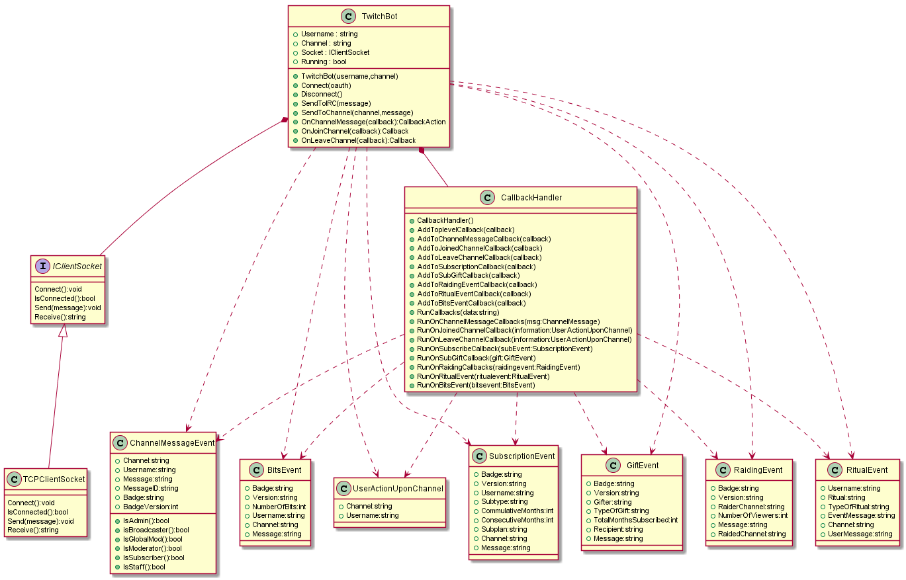

# MightyPecoBot
MightyPecoBot is a TwitchBot implemented from scratch for funsies.  
I used .net core 2.1 with no external libraries.

## Installation

Clone the repository and copy the classes to your .net Project
```bash
git clone https://github.com/raulcorreia7/pecobot
```

## Usage

```csharp
using MightyPecoBot;

class Program
    {
        //Your username
        const string USERNAME = "mightypecobot";
        //Your channel
        const string CHANNEL = "frosticecold";

        static void Main(string[] args)
        {
            //Select waht log level you want (optional = NORMAL)
            //BotLogger.LogLevel = LOG_LEVEL.DEBUG;

            //Read or provide your own OAUTH_TOKEN
            string OAUTH_TOKEN = System.IO.File.ReadAllText("oath.txt");
            //Create the bot
            TwitchBot clientbot = new TwitchBot(USERNAME, CHANNEL);
            //Connect
            clientbot.Connect(OAUTH_TOKEN);
            //Send debug hello world!
            clientbot.Debug();

            //Optional to read input from the console
            while (clientbot.Running)
            {
                string data = Console.ReadLine();
                if (!string.IsNullOrEmpty(data))
                    clientbot.SendToIRC(data);
            }
        }
    }

```

## Adding your own behaviour

```csharp
using MightyPecoBot.Callbacks;
using MightyPecoBot.Parsing;
class Program{
    static void Main(string[] args)
    {
        TwitchBot clientbot = new TwitchBot(USERNAME, CHANNEL);
        //Connect
        clientbot.Connect(YOUR_OWN_OAUTH_TOKEN);

            //Add an action after someone says something
        clientbot.OnChannelMessage((ChannelMessageEvent message) =>
            {   
                //You either use your default channel or the message responses channel
                clientbot.SendToChannel(message.Channel, "Hello this is your custom message!");
                return CallbackAction.CONTINUE;//Continue with all other actions queued onChannelMessage
            });
            //Add an action after someone joins in.
            clientbot.OnJoinChannel((UserActionUponChannel information) =>
            {
                clientbot.SendToChannel(information.Channel, "Hello " + information.Username + "!");
                return CallbackAction.CONTINUE;//Continue with all other actions queued onChannelMessage
            });

            //Add an action after someone leaves.
            clientbot.OnLeaveChannel((UserActionUponChannel information) =>
            {
                clientbot.SendToChannel(information.Channel, "Byebye " + information.Username);
                return CallbackAction.CONTINUE;//Continue with all other actions queued onChannelMessage
            });
            //Add an action when someone raids your channel
            clientbot.OnRaidingEvent((RaidingEvent raidingevent) =>
            {
                clientbot.SendToChannel(raidingevent.RaidedChannel, "HELP! Were are being raided by: " + raidingevent.RaiderChannel);
                return CallbackAction.SKIP_OTHERS;//Don't do anything more actions queued up
            });

            //Add an action when someone sub gifts someone
            clientbot.OnSubGift((GiftEvent g)=>{
                clientbot.SendToChannel(clientbot.DefaultChannel,g.Message);
                return CallbackAction.CONTINUE;//Continue with all other actions queued onChannelMessage
            });

            //Add an action when somone subscribed
            clientbot.OnSubscribe((SubscriptionEvent subevent)=>{
                clientbot.SendToChannel(subevent.Channel,"WHOWHO! " + subevent.Username + " subscribed for: " + subevent.CommulativeMonths + " months.");
                return CallbackAction.SKIP_OTHERS;//Don't do anything more actions queued up
            });

    }
}
```
### Tips:
    Be sure if you want your callbacks to stop or continue,
    they are all saved and called iteratively.
    If you use CallbackAction.SKIP_OTHERS, no more callbacks will be called for the same type of event.
## Classes used

The class diagram is very condensed, there are many more functions implemented ready to use.
## Contributing
Pull requests are welcome. For major changes, please open an issue first to discuss what you would like to change.

## License
[MIT](https://choosealicense.com/licenses/mit/)
